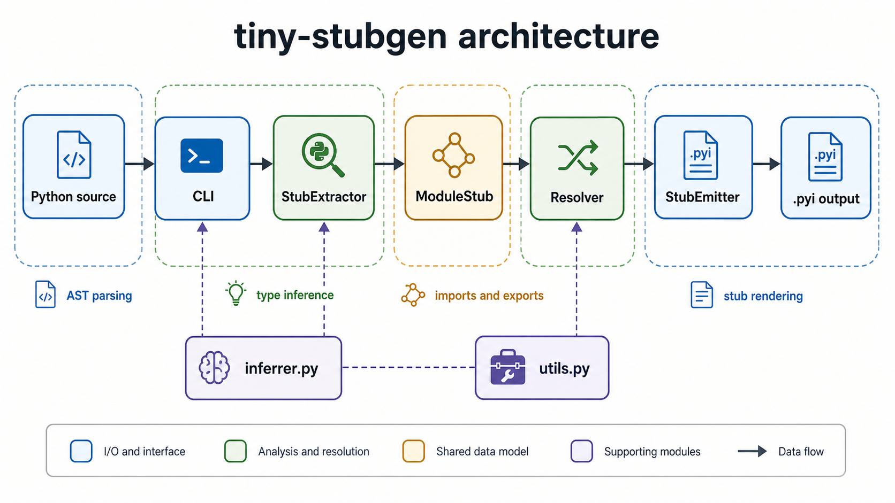

# Architecture

tiny-stubgen uses a pipeline that converts Python source into `.pyi` text:

```text
Python source
    |
    v
Extractor  ->  ModuleStub
    |
    v
Resolver   ->  processed ModuleStub
    |
    v
Emitter    ->  .pyi text
```



## Core Data Model

Modules communicate through dataclasses in `models.py`. `ModuleStub` is the central container:

```text
ModuleStub
├── imports: list[ImportInfo]
├── variables: list[VariableInfo]
├── functions: list[FunctionInfo]
├── classes: list[ClassInfo]
├── conditional_blocks: list[ConditionalBlock]
├── all_names: list[str] | None
└── docstring: str | None
```

Key model types:

| Model | Purpose |
|-------|---------|
| `ImportInfo` | Import statements, names, aliases, relative levels, and `TYPE_CHECKING` marker |
| `FunctionInfo` | Function signature, parameters, return type, decorators, async marker, overloads |
| `ParameterInfo` | Parameter name, annotation, default, and kind |
| `ClassInfo` | Class bases, methods, attributes, decorators, inner classes |
| `AttributeInfo` | Class/instance attributes, `ClassVar`, `Final`, enum marker |
| `VariableInfo` | Module variables, annotations, TypeAlias and typing assignment detection |
| `ConditionalBlock` | Conditional imports and definitions under platform/version guards |

## Extractor

`StubExtractor` walks the AST and extracts structured stub data.

Responsibilities:

- imports, from-imports, star imports, relative imports, and `TYPE_CHECKING` imports
- full function signatures including positional-only, keyword-only, `*args`, `**kwargs`, defaults, async, and overloads
- class bases, keywords, methods, attributes, decorators, and inner classes
- instance attributes from `__init__`
- dataclasses, `NamedTuple`, `TypedDict`, enums, and `__slots__`
- common platform/version conditionals
- `__all__`, including simple `.append()` and `.extend()` patterns

## Inferrer

`inferrer.py` contains conservative inference helpers:

- `infer_type_from_value(node)` infers module variables and attributes from literals, collections, constructor calls, unions, f-strings, and other safe expressions.
- `infer_type_from_default(node)` infers parameter types more conservatively from default values.
- `classify_decorator(node)` recognizes known decorators and returns a `DecoratorKind`.

## Resolver

The resolver performs post-processing:

1. `deduplicate_imports()` merges imports from the same module.
2. `resolve_exports()` applies `__all__` and public/private filtering.
3. `postprocess()` composes import deduplication with export filtering under a `GenerationPolicy`.

## Emitter

`StubEmitter` renders a `ModuleStub` into `.pyi` text:

- groups `__future__`, runtime, and typing imports
- adds needed typing imports such as `Any` and `Optional`
- formats function signatures and default ellipses
- emits class attributes, methods, inner classes, and empty bodies
- emits overloads before implementation signatures
- applies `GenerationPolicy` switches for imports, decorators, annotations, class metadata, and conditionals

## Extension Points

- Add inference patterns in `inferrer.py`.
- Add decorator kinds in `inferrer.py` and `models.py`.
- Change output formatting in `emitter.py`.
- Add special class handling in `extractor.py`.
- Add API/CLI controls through `policies.py` and tests.

